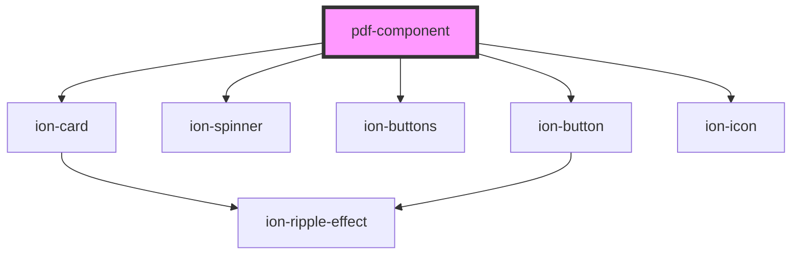

# pdf-component

<!-- Auto Generated Below -->

## Properties

| Property | Attribute | Description         | Type     | Default     |
| -------- | --------- | ------------------- | -------- | ----------- |
| `src`    | `src`     | PDF document source | `string` | `undefined` |

## Events

| Event          | Description                           | Type                  |
| -------------- | ------------------------------------- | --------------------- |
| `pageRendered` | Emitted when a page has been rendered | `CustomEvent<number>` |

## Dependencies

### Depends on

- ion-card
- ion-spinner
- ion-buttons
- ion-button
- ion-icon

### Graph

----------------------------------------------

*Built with [StencilJS](https://stenciljs.com/)*
